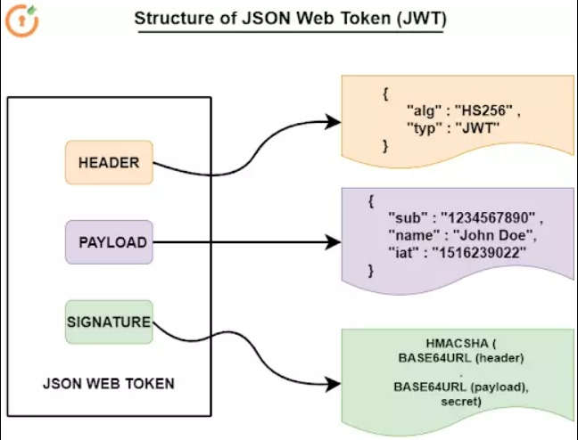

# JWT 

JWT, or JSON Web Token, is an open standard used to share information between two parties securely — a client and a server. In most cases, it’s an encoded JSON containing a set of claims and a signature. It’s usually used in the context of other authentication mechanisms like OAuth, OpenID to share user-related information. It’s also a popular way to authenticate/authorize users in a microservice architecture.

JWT authentication is a token-based stateless authentication mechanism. It is popularly used as a client-side-based stateless session, this means the server doesn’t have to completely rely on a data store (or) database to save session information.

# When should you use JSON Web Tokens?

* Authorization: This is the most common scenario for using JWT. Once the user is logged in, each subsequent request will include the JWT, allowing the user to access routes, services, and resources that are permitted with that token. Single Sign On is a feature that widely uses JWT nowadays, because of its small overhead and its ability to be easily used across different domains.

* Information Exchange: JSON Web Tokens are a good way of securely transmitting information between parties. Because JWTs can be signed—for example, using public/private key pairs—you can be sure the senders are who they say they are. Additionally, as the signature is calculated using the header and the payload, you can also verify that the content hasn't been tampered with.