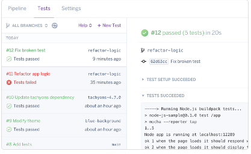

# First Journal

What we have learned during the first class are the following


* Setup a Node.js Package using npm.
* Create CommonJS modules
* Create a simple express server
* See passing tests via GitHub actions (CI)
* Deploy to Heroku using CD

## To sumrise the concept of Node.js :

Node.js is an open-source, cross-platform, 
back-end JavaScript runtime environment 
that runs on the V8 engine and executes
JavaScript code outside a web browser.

## Node.js can be installed using :

```
sudo apt-get install nodejs

```
## Create CommonJS modules
```
npm install <your-module-name>

```
## Create a simple express server

```js
const express = require('express');
const app = express();
// to start the app on a port you already defined
function start(port) {
    app.listen(port, () => {
        console.log(`i'm listening on port${port}`);
    });
}

```

## See passing tests via GitHub actions (CI)


## Deploy to Heroku using CD





