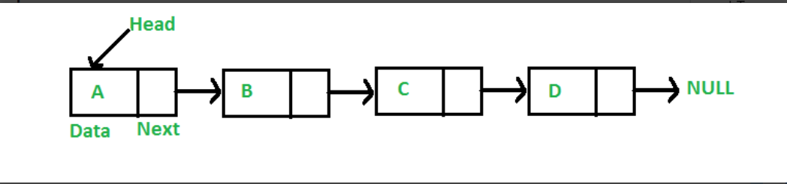
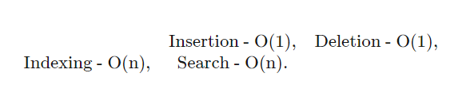
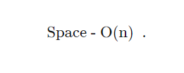

# Linked List

## Introduction

* Linked List is a linear data structure. Unlike arrays, linked list elements are not stored at a contiguous location; the elements are linked using pointers.

* In simple words, a linked list consists of nodes where each node contains a data field and a reference(link) to the next node in the list.

## Time complexity

* Time

Linked lists have most of their benefit when it comes to the insertion and deletion of nodes in the list. Unlike the dynamic array, insertion and deletion at any part of the list takes constant time.

However, unlike dynamic arrays, accessing the data in these nodes takes linear time because of the need to search through the entire list via pointers. It's also important to note that there is no way of optimizing search in linked lists. In the array, we could at least keep the array sorted. However, since we don't know how long the linked list is, there is no way of performing a binary search:

* space 

Linked lists hold two main pieces of information (the value and pointer) per node. This means that the amount of data stored increases linearly with the number of nodes in the list. Therefore, the space complexity of the linked list is linear

