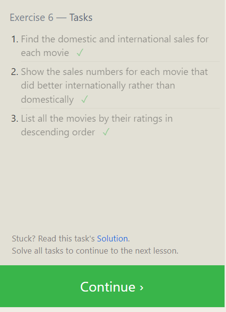

# reading-notes

**Task** **06**
# **Task** **06**

# reading-notes
**Task** **07**

**Task** **08**

**Task** **09**

**Task** **10**

**Task** **11**

**Task** **12**

**Task** **13**

**Task** **14**

**Task** **15**

**Task** **16**

**Task** **17**

**Task** **18**