# reading-notes
# **Task** **01**

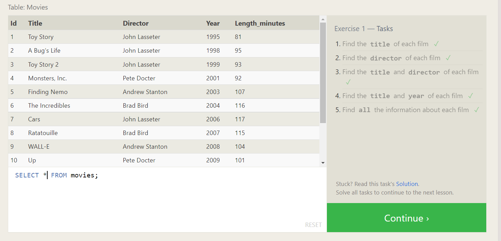

# **Task** **02**

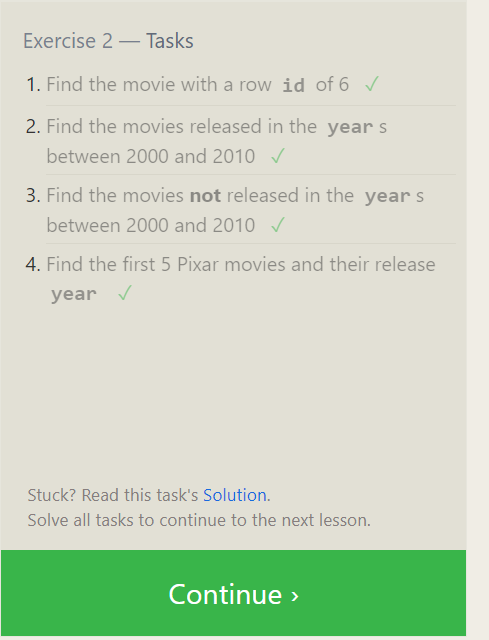

# **Task** **03**

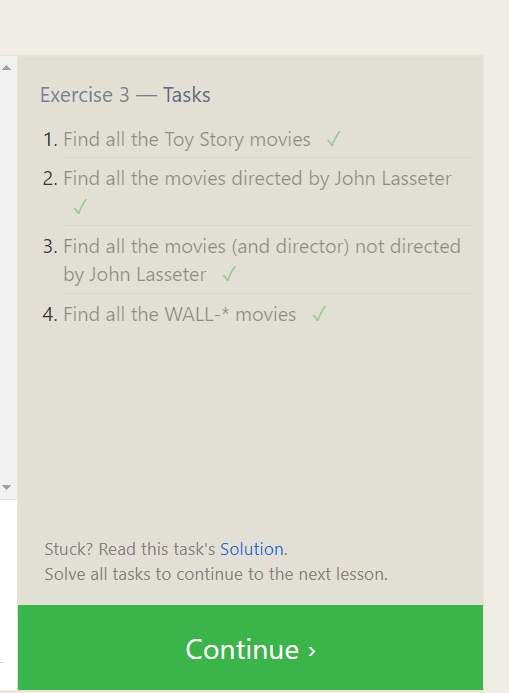

# **Task** **04**

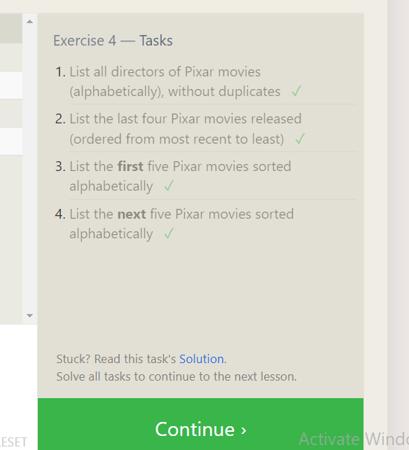

# **Task** **05**

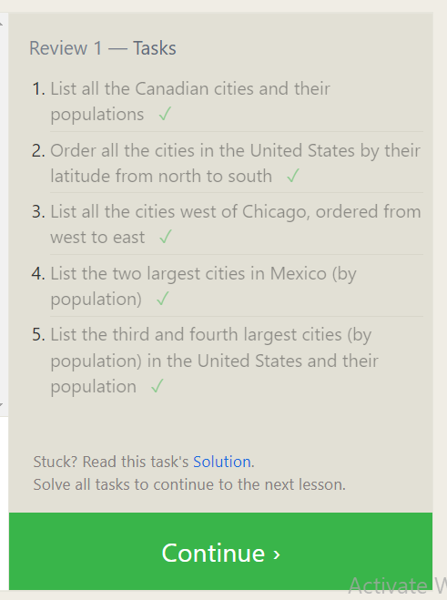

# **Task** **06**

# **Task** **07**

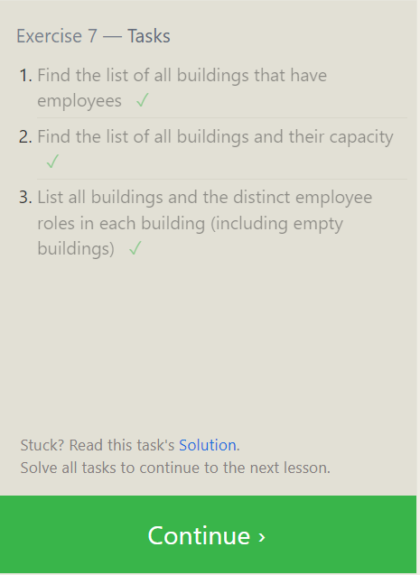

# **Task** **08**

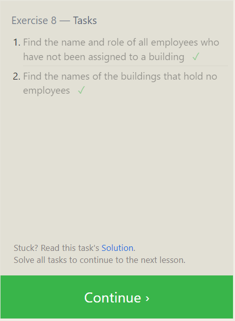

# **Task** **09**

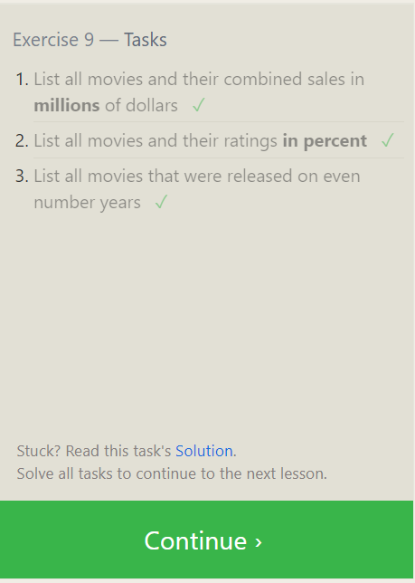

# **Task** **10**

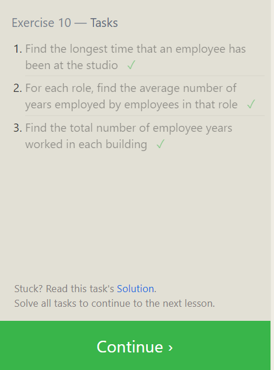

# **Task** **11**

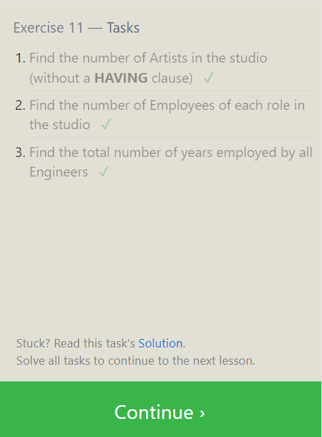

# **Task** **12**

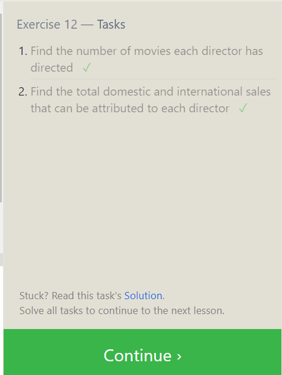

# **Task** **13**

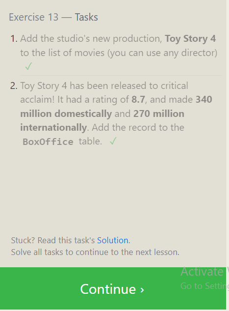

# **Task** **14**

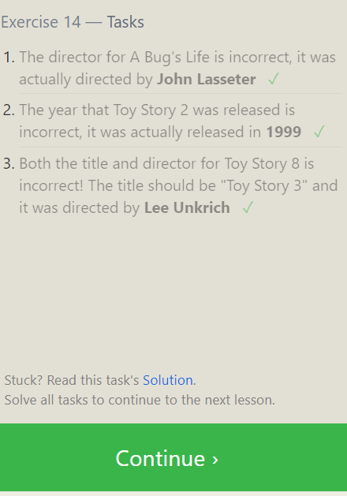

# **Task** **15**

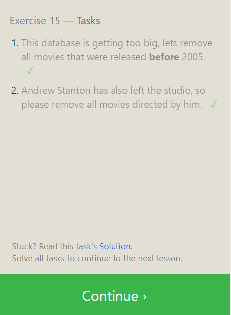

# **Task** **16**

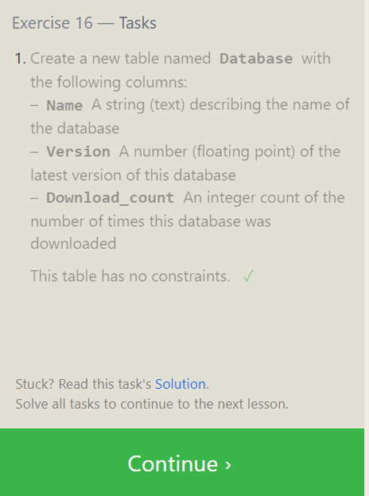

# **Task** **17**

# **Task** **18**

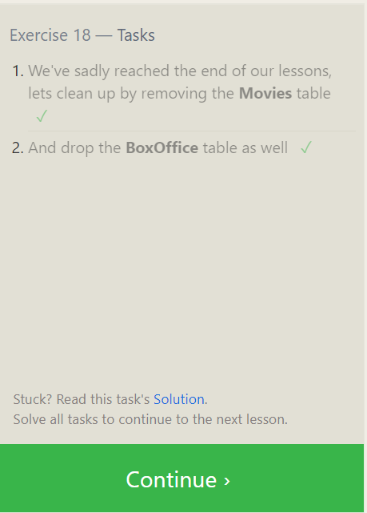

# summary 

SQL is a domain-specific language used in programming and designed for managing
data held in a relational database management system, or for stream processing
in a relational data stream management system.