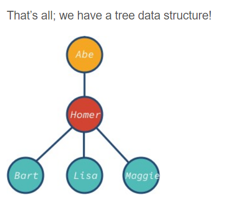

# Trees

## **Basic concepts**

A tree is a data structure where a node can have zero or more children. Each node contains a value. Like graphs, the connection between nodes is called edges. A tree is a type of graph, but not all graphs are trees (more on that later).

These data structures are called “trees” because the data structure resembles a tree . It starts with a root node and branch off with its descendants, and finally, there are leaves.


**properties of trees:**

The top-most node is called root.
A node without children is called leaf node or terminal node.
Height (h) of the tree is the distance (edge count) between the farthest leaf to the root.
A has a height of 3
I has a height of 0
Depth or level of a node is the distance between the root and the node in question.
H has a depth of 2
B has a depth of 1


## **Implementing a simple tree data structure**

```js
	
class TreeNode {
  constructor(value) {
    this.value = value;
    this.descendants = [];
  }
}

```

We can create a tree with 3 descendants as follows:

```js
// create nodes with values
const abe = new TreeNode('Abe');
const homer = new TreeNode('Homer');
const bart = new TreeNode('Bart');
const lisa = new TreeNode('Lisa');
const maggie = new TreeNode('Maggie');

// associate root with is descendants
abe.descendants.push(homer);
homer.descendants.push(bart, lisa, maggie);

```



The node abe is the root and bart, lisa and maggie are the leaf nodes of the tree. Notice that the tree’s node can have different descendants: 0, 1, 3, or any other value.

## **Tree data structures applications :**

* Maps
* Sets
* Databases
* Priority Queues
* Querying an LDAP (Lightweight Directory Access Protocol)
* Representing the Document Object Model (DOM) for HTML on Websites.